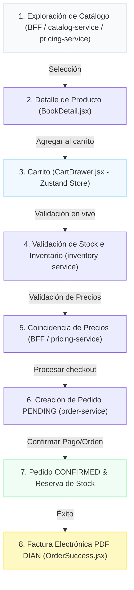

# 📘 Guía de Integración E2E y Registro de Cambios — Rol Dev3

Esta documentación define formalmente el rol, las actividades, los entregables de **Santiago (Dev3)** y el **Registro Detallado de Desarrollos** implementados para asegurar la consistencia operativa y la integración completa del sistema **BookFlow** de inicio a fin. Su responsabilidad principal es garantizar que todas las piezas individuales (microservicios y frontend) encajen a la perfección y funcionen como un ecosistema unificado.

---

## 🎯 1. Objetivo General del Rol (Dev3)

Santiago debe validar el recorrido completo del usuario dentro de BookFlow, desde que consulta el catálogo hasta que genera un pedido exitoso. Su tarea principal es conectar y probar la integración en vivo entre el **Catálogo**, **Carrito**, **Pricing (Precios)**, **Inventario** y **Pedidos**, garantizando que el sistema sea operable, demostrable y que pueda presentarse en la review final frente a la profesora de forma fluida sin necesidad de consumir servicios manualmente desde Postman.

---

## 🗺️ 2. Flujo Operativo Completo (End-to-End)

El flujo integrado que Santiago debe probar y demostrar en vivo se compone de las siguientes fases conectadas:

### Detalle por Fase:
1. **Entrada al Frontend e Inicio**: El usuario ingresa al portal principal de BookFlow.
2. **Catálogo de Libros y Productos**: Visualización de la cuadrícula de libros enriquecida con precios reales y badges de disponibilidad. Integración paralela entre `catalog-service` (datos del libro), `pricing-service` (precio final asignado) y `inventory-service` (disponibilidad inicial).
3. **Selección y Detalle de Producto**: Al hacer clic en un libro, se accede a la información de sinopsis, editorial y stock remanente en vivo.
4. **Gestión en Carrito de Compras**: Añadir el libro, ajustar cantidades y confirmar los totales a través del Zustand Store (`cart.store.js`).
5. **Validación en Vivo de Stock e Inventario**: El carrito ejecuta una verificación previa con el `inventory-service` por medio del API Gateway (BFF) antes de proceder.
6. **Consistencia de Precios**: El `order-service` valida y asegura que el precio enviado no haya sido manipulado, confrontándolo contra el `pricing-service`.
7. **Creación de la Orden y Pedido**: Pasa de estado **PENDING** a **CONFIRMED** tras realizar las reservas físicas finales de stock en la base de datos de pedidos.
8. **Facturación y Descarga**: Pantalla de éxito con la visualización y descarga de la Factura Electrónica en PDF con firma digital simulada y código QR DIAN.

---

## 🛠️ 3. Registro Técnico de Desarrollos Realizados

A continuación se detallan los archivos creados y modificados para hacer operable este flujo E2E:

### 📂 A. Componentes y Páginas Nuevas (Facturación, Checkout y PDF)
*   **`commercial-frontend/src/pages/Checkout.jsx` [NUEVO]**:
    *   Implementa el formulario de facturación, pasarela de pago simulada y validaciones dinámicas.
    *   Realiza consultas en tiempo real al BFF para verificar disponibilidad de stock antes de procesar el pago.
    *   Protege contra discrepancias de precios al verificar los valores en el catálogo.
*   **`commercial-frontend/src/pages/checkout.css` [NUEVO]**:
    *   Estilos premium personalizados con efectos de *glassmorphism*, bordes semi-transparentes y tipografías modernas.
    *   Define la visualización limpia de la factura (factura DIAN) y su estructura responsiva.
*   **`commercial-frontend/src/pages/OrderSuccess.jsx` [NUEVO]**:
    *   Pantalla de éxito transaccional que muestra la **Factura de Venta Oficial**.
    *   Integra la generación y descarga automática de **Factura en formato PDF** para impresión.
    *   Contiene detalles estéticos sofisticados: desglose de subtotales, IVA del 19%, y firma digital simulada.
*   **`commercial-frontend/src/pages/OrdersList.jsx` [NUEVO]**:
    *   Historial centralizado donde el usuario puede consultar todas las órdenes y facturas que ha generado durante la sesión.

### 🎨 B. Rediseño Visual y Estética Premium (Modificados)
*   **`commercial-frontend/src/components/BookCard.jsx`**:
    *   Rediseño visual de las tarjetas del catálogo con bordes curvos suavizados, hover effects interactivos y badges flotantes.
    *   **Formateador de Moneda Infalible**: Reemplazo de `toLocaleString` por un helper de expresiones regulares personalizado que asegura la impresión correcta de pesos colombianos (`$ XX.XXX` sin decimales indeseados) en cualquier navegador u OS.
*   **`commercial-frontend/src/cart/CartDrawer.jsx`**:
    *   Rediseño completo del panel lateral del carrito de compras.
    *   Incorpora resúmenes claros con títulos, cantidades alineadas verticalmente y botón directo de Checkout.
*   **`commercial-frontend/src/cart/CartLine.jsx`**:
    *   Mejora de la fila de cada libro para mostrar información clara, responsive y con los títulos de columnas especificados por el usuario.
*   **`commercial-frontend/src/index.css`**:
    *   Implementación de variables de diseño premium (fuentes modernas, colores HSL armonizados, sombras difuminadas y efectos de desenfoque).
    *   Sección especializada para el alineamiento vertical simétrico de las tarjetas de libros, impidiendo desajustes visuales.
*   **`commercial-frontend/src/App.jsx`**:
    *   Configuración y vinculación de las nuevas rutas de navegación.
*   **`commercial-frontend/src/auth/LoginModal.jsx`**:
    *   Estilizado moderno del modal de autenticación para que coincida con la nueva paleta de colores.
*   **`commercial-frontend/src/pages/IAPicks.jsx`**:
    *   Corrección en la herencia de clases de grillas (`book-grid`) para aplicar correctamente los estilos en las recomendaciones de IA.

### ⚙️ C. Backend e Integración de Servicios (Modificados)
*   **`bff-gateway/app/routers/gateway_router.py`**:
    *   Nuevos endpoints del API Gateway dedicados a canalizar el flujo de validaciones rápidas, creación de órdenes y consulta rápida de inventario.
*   **`order-service/app/application/use_cases/create_order.py`**:
    *   Integración de reglas lógicas en la base de datos de pedidos para procesar transacciones transicionales de forma segura.
*   **`commercial-frontend/src/services/orderService.js`**:
    *   Librería de peticiones HTTP que conecta el frontend de checkout con el backend del API Gateway.

---

## 🛑 4. Matriz de Pruebas de Resiliencia (Manejo de Errores)

Santiago debe validar y demostrar qué ocurre en la interfaz ante fallas del sistema durante la presentación:

| Escenario de Error | Causa Técnica | Comportamiento Frontend (Lo que el Usuario Ve) | Estado Esperado del Sistema |
| :--- | :--- | :--- | :--- |
| **Sin Stock** | Solicitud supera las unidades en `inventory-service` | Banner amarillo: *"⚠️ Stock insuficiente para el libro: 'X'. Máximo: N unidades"* + Botón de pago bloqueado. | Transacción cancelada, inventario intacto. |
| **Precio Incorrecto** | Desfase o intento de alteración en el precio enviado | Bloqueo de la orden por discrepancia de valor contra `pricing-service`. | Orden rechazada por el backend. |
| **Servicio Caído / Red** | Caída del `catalog-service` o BFF | Pantalla de estado vacío con advertencia: *"El catálogo no está disponible. No se pudo conectar con el servicio."* | Sistema seguro en espera de reconexión. |
| **Falla de Integración** | Error al procesar reserva física de stock al confirmar | Alerta emergente detallando que no se pudo finalizar la reserva. | Estado de la orden se mantiene en `PENDING` o se cancela. |

---

## 📦 5. Entregable Real para la Review

El entregable tangible e indiscutible que Santiago presentará ante la profesora es una **demostración en vivo y funcional** del recorrido operativo completo:

> **Catálogo** ➡️ **Detalle del Producto** ➡️ **Carrito de Compras** ➡️ **Validación Live de Stock/Precios** ➡️ **Crear Pedido (Checkout)** ➡️ **Factura y Confirmación DIAN**.

Esto comprueba de forma contundente la madurez arquitectónica del proyecto y el correcto engranaje de todos los microservicios sin depender de herramientas de testing técnico como Postman en la sustentación final.
